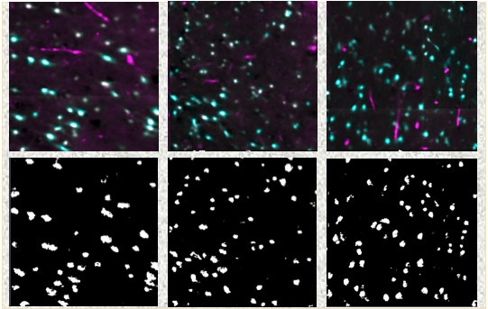

DIPcell
=======

Digital image processing for brain cells - investigations with UCSF.

What's going on
---------------
Non-destructive imaging methods preserve tissue integrity, leading to improved topography analysis, which are critical in the study of neurodegenerative diseases, such as Alzheimer’s Disease (AD). Our approach utilizes an immunofluorescence (IF) assay for measuring the colocalization of proteins and structures through staining of human post-mortem tissue to access and quantify neuron populations. This paper briefly discusses neuro-positive IF biomarkers and U-Net as part of a segmentation algorithms to detect blobs.

-	ISBI'21 paper: https://www.overleaf.com/project/5ffb9450e364bcb3e8ddf3d6
- [code](coming soon)

<table border="0">
 <tr>
    <td>
    </td>
    <td>
     

      - Neuron detection from IF tissue using U-Net
     

     </td>
 </tr>
</table>

The Team behind the Project
---------------------------
- Silvia Miramontes MIDS, Affiliate at Lawrence Berkeley National Lab [Top Left].
- Antonia M.H. Piergies BA, Staff Research Associate at Memory Aging Center, UCSF [Top Right]. 
- Lea T. Grinberg PhD, Principal Investigator Grinberg Lab, Memory Aging Center, UCSF [Bottom Left].
- Daniela M. Ushizima PhD, Staff Scientist at Lawrence Berkeley National Lab and Affiiliate at Bakar Institute, UCSF [Bottom Right].

 
 

